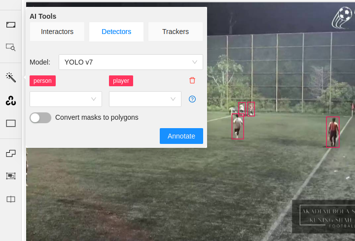

# Integrate custom YOLOv8 model into CVAT for automatic annotation.



## Installation (Linux Ubuntu)

Generally would follow this documentation (https://opencv.github.io/cvat/docs/administration/advanced/installation_automatic_annotation/)

In the CVAT directory, run:

1. Stop all containers first, if any.

	```
	docker compose down
	```
 
1. Start CVAT together with the plugin use for AI automatic annotation assistant.
	
	```
	docker compose -f docker-compose.yml -f components/serverless/docker-compose.serverless.yml up -d
	```
1. Create an account
	```
	docker exec -it cvat_server bash -ic 'python3 ~/manage.py createsuperuser'
	```

1. Install `nuctl`*
   
	```
	wget https://github.com/nuclio/nuclio/releases/download/<version>/nuctl-<version>-linux-amd64
	```
	

1. After downloading the nuclio, give it a proper permission and do a softlink.*
   
	```
	sudo chmod +x nuctl-<version>-linux-amd64
	sudo ln -sf $(pwd)/nuctl-<version>-linux-amd64 /usr/local/bin/nuctl
	```
	

1. Build the docker image and run the container. After it is done, you can use the model right away in the CVAT.
	```
	./serverless/deploy_cpu.sh path/to/this/folder/
	```

1. Troubleshooting
   - Check that your `nuclio` function is running correctly   
     `docker ps --filter NAME=custom-model-yolov8`:
     ```
     CONTAINER ID   IMAGE                        COMMAND       CREATED          STATUS                    PORTS                                         NAMES
     3dc54494bbb8   custom-model-yolov8:latest   "processor"   52 minutes ago   Up 52 minutes (healthy)   0.0.0.0:32896->8080/tcp, :::32896->8080/tcp   nuclio-nuclio-custom-model-yolov8
     ```
   - If it is not running check the container's log, it might reveal what is going wrong:   
     `docker logs 3dc54494bbb8` (CONTAINER ID)
     ```
     ...
     24.01.31 12:28:35.522                 processor (D) Processor started
     24.01.31 12:29:27.171 sor.http.w0.python.logger (I) Run custom-model-yolov8 model {"worker_id": "0"}
     ```
   - If installing on WSL2, you should update the ".wslconfig" file WLS2 to allow WSL at least 6 GB RAM. Put the .wslconfig file in the C:\/Users\/\<username\> folder. If DOCKER crashes frequently or auto annotation fails immediately after starting, it is probably because of low RAM. Use the alternative function if the installation fails (worked for CVAT-2.16.2 installation in WSL2, with 6 GB allowed to WSL2).
   
Note: * is a one time step.

## File Structure

- [`function.yaml`](function.yaml): Declare the model so it can be understand by CVAT. It includes setup the docker environment.

- [`main.py`](main.py): Contain the handle function that will serve as the endpoint used by CVAT to run detection.

- `custom-yolov8n.pt`: Your custom yolov8 model.

## References

1. https://opencv.github.io/cvat/docs/manual/advanced/serverless-tutorial/#adding-your-own-dl-models

	Official documentation on how to add the custom model.

1. https://stephencowchau.medium.com/journey-using-cvat-semi-automatic-annotation-with-a-partially-trained-model-to-tag-additional-8057c76bcee2
